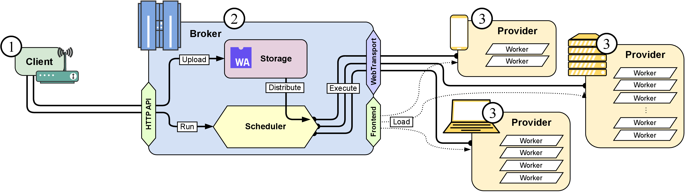

# wasimoff

This is the codebase for the result of my [Master's thesis "Opportunistic Distributed Computation Offloading using WebAssembly"](https://git.informatik.uni-hamburg.de/dos/teaching/theses/ma_anton_semjonov/thesis). It is a computation offloading platform which uses WebAssembly as its executable format and sends requests to participating browser clients through a central broker over WebTransport streams.



The condensed paper has been accepted on the [*LESS'24 (aka. STARLESS'24)](https://starless.iit.cnr.it/) that is co-located with the IEEE Percom'24. Its title is `Wasimoff: Distributed Computation Offloading Using WebAssembly in the Browser`.

### Essential roles

The three essential roles **Broker**, Web**Provider** and **Client** can be found in their respective subdirectories.

* The **Broker** is a central entity to which all Providers connect and which then distributes tasks among them. Clients talk to the Broker to upload executables and queue tasks. It is written in Go and uses WebTransport connections over QUIC for the Providers.
* Web**Providers** are the participants that share their resources with the network. An important goal of this thesis was to implement the Provider entirely on the Web platform API, so it can run in the browser simply by opening a web page. It is written in Vue.js and uses Workers to execute the WebAssembly modules concurrently.
* The **Client** interface is simply an HTTP API, therefore only an example of using `curl` in Bash is shown here. It contains a number of examples on how to write offloading configurations.

### WASI applications

The WebAssembly System Interface (WASI) was chosen as an abstraction layer for the offloaded tasks and the subdirectory `wasi-apps/` contains a number of example applications, which use this compilation target to show off its versatility and serve as example workloads during the evaluation.

* `ffmpeg` is a compilation of the popular FFmpeg toolkit to WebAssembly. It can be used to transcode videos in a browser tab.
* `helloworld` is a collection of different languages (Rust, TinyGo, WAT) targeting basic features of the WASI target `wasm32-wasi`.
* `travelling_salesman` is an implementation of the .. *you guessed it* .. Travelling Salesman Problem in Rust. It can be compiled to various native binary formats but also to WASI and it serves as the computational workload in all of the evaluation runs.
* `web-demo` is a minimal example of using the `browser_wasi_shim` to execute WebAssembly binaries with environment variables and commandline arguments in the browser.

### Evaluation

The `evaluation` subdirectory contains an extensive Ansible configuration to deploy a testing environment on the Hetzner Cloud, as well as various further subdirectories, that describe the performed evaluations and contain result data. Each evaluation has a separate README with information on how to reproduce the results.

### Experiments

The `experiments` directory contains various experiments and evaluations of pieces of the networking stack that were considered.


### Dockerized deployment

This repository includes a multi-stage `Dockerfile`, which:
* compiles the `broker` binary in a `golang:1.21-bookworm` image
* compiles the webprovider frontend dist in a `node:20-bookworm` image
* copies both in a barebones `alpine` image to save space (even a `scratch` image would be suitable but that would complicate implementing healthchecks with curl)
* and prepares another image with a headless Chromium to act as the provider

You can build the combined Broker + Frontend image by specifying the target for `docker`:

```
docker build -t wasimoff:broker --target wasimoff ./
```

The headless provider image can be built like this:

```
docker build -t wasimoff:provider --target provider ./
```

#### Docker Compose

Additionally, a `docker-compose.yaml` file is provided, which starts the combined broker in one container and a headless provider in another container. The broker's ports are forwarded to your local machine, so that you can directly issue `client.sh` commands using `BROKER=http://localhost:4080`. Copy the `provider01` section multiple times if you want to simulate multiple providers and run:

```
docker compose up --build
```

The config is a little tricky and is not really suitable for a public deployment:
* some of the used Web APIs require a secure context, thus even loading the frontend from `http://broker:4080/` will **not** work. Luckily `localhost` is a secure context but that requires the `provider01` and `broker` to be in the same networking namespace.
* using `network_mode: service:broker` to put the provider into the broker's networking namespace seemed to work on first glance but the WebTransport socket wouldn't connect
* using `networking_mode: host` with a **rootless** Docker installation worked for communication between both containers but made the broker inaccessible from the host machine
* so please, use a normal, *system*-Docker to start this compose file :)