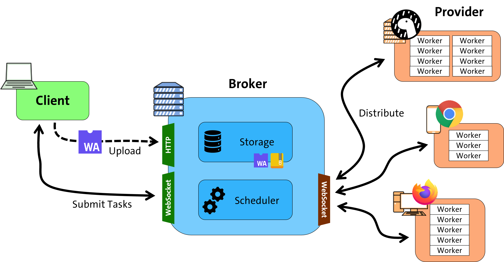

# wasimoff

This is the codebase for the computation offloading and task distribution research prototype **wasimoff**. It is a framework which uses WebAssembly as its executable format and is able to send computational tasks to volunteers' browsers through a central broker. Targeting a modern browser API as an execution environment makes participation *exceedingly* simple, while the versatility of WebAssembly supports many different computational problems.



Publications relating to this project:

* [Semjonov, A. (2023). *Opportunistic Distributed Computation Offloading using WebAssembly* (Master’s thesis. University of Hamburg).](https://edoc.sub.uni-hamburg.de/informatik/volltexte/2024/273/pdf/Anton_Semjonov_Opportunistic_Distributed_Computation_Offloading_using_WebAssembly.pdf)

* [Semjonov, A., Bornholdt, H., Edinger, J., & Russo, G. R. (2024, March). *Wasimoff: Distributed computation offloading using WebAssembly in the browser.* In *2024 IEEE International Conference on Pervasive Computing and Communications Workshops and other Affiliated Events (PerCom Workshops)* (pp. 203-208). IEEE.](https://ieeexplore.ieee.org/abstract/document/10503392/) (+ [Artifact](https://ieeexplore.ieee.org/abstract/document/10502812/))

* [Semjonov, A., & Edinger, J. (2024, December). *Demo: Zero-Setup Computation Offloading to Heterogeneous Volunteer Devices Using Web Browsers.* In *Proceedings of the 25th International Middleware Conference: Demos, Posters and Doctoral Symposium* (pp. 3-4).](https://dl.acm.org/doi/abs/10.1145/3704440.3704776)


### Essential roles

The three essential roles **Broker**, **Provider** and **Client** can be found in their respective subdirectories.

* The **Broker** is a central entity to which all Providers connect and which then distributes tasks among them. Clients talk to the Broker to upload executables and queue tasks. It is written in Go and uses Protobuf messages over WebSocket connections.
* **Providers** are the participants that share their resources with the network. An important goal of this prototype was to implement the Provider entirely on the Web platform API, so it can run in the browser simply by opening a web page.
  * A **Webprovider** is written in Vue.js and uses Workers to execute the WebAssembly modules concurrently.
  * The exact same TypeScript code can also be run with **Deno**, thus there is also a CLI script to start a computational Provider in a terminal.
* The **Client** interface is either a simple HTTP API or also a WebSocket connection for asynchronous task submission. Examples exist using `curl` in Bash, as well as a CLI written in Go. It contains a number of examples on how to write job configurations.

### WASI applications

The WebAssembly System Interface (WASI) was chosen initially as an abstraction layer for the offloaded tasks and the subdirectory `wasi-apps/` contains a number of example applications, which use this compilation target to show off its versatility and serve as example workloads during the evaluation.

* `ffmpeg` is a compilation of the popular FFmpeg toolkit to WebAssembly. It can be used to transcode videos in a browser tab.
* `helloworld` is a collection of different languages (Rust, TinyGo, WAT) targeting basic features of the WASI target `wasm32-wasi`.
* `travelling_salesman` is an implementation of the .. *you guessed it* .. Travelling Salesman Problem in Rust. It can be compiled to various native binary formats but also to WASI and it serves as the computational workload in all of the evaluation runs.
* `web-demo` is a minimal example of using the `browser_wasi_shim` to execute WebAssembly binaries with environment variables and commandline arguments in the browser.

### Experiments

The [`experiments` repository](https://github.com/wasimoff/experiments) contains various experiments and evaluations of pieces of the networking stack that were considered.


### Containerized deployment

This repository includes a multi-stage `Dockerfile`, which:
* compiles the `broker` binary in a `golang` image,
* compiles the webprovider frontend dist in a `node` image,
* copies both to a barebones `alpine` image and
* prepares another headless provider with a `denoland/deno` image.

You can compile both main images individually with:
* `docker build --target wasimoff -t wasimoff:broker .` or `make broker`
* `docker build --target provider -t wasimoff:provider .` or `make provider`

Or, for a quick test environment, use the `docker-compose.yaml` file with:

```
docker compose up --build
```
