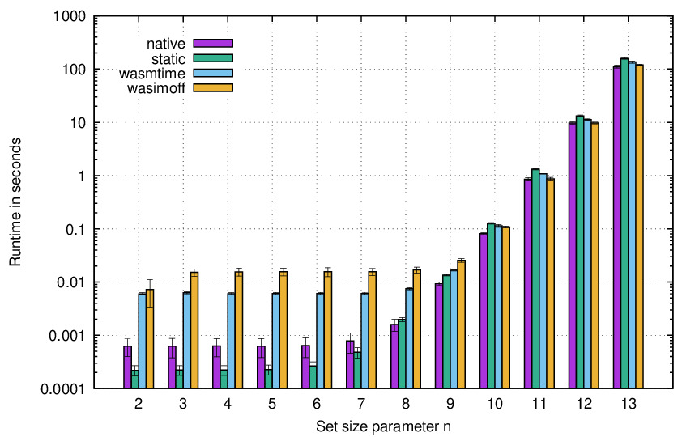

# binaryformats / tsp_hyperfine

This evaluation compares the performance of different binary formats by compiling
the Travelling Salesman Problem workload `tsp` as:

* a native executable for the current platform
* a static executable using musl libc
* an optimized WebAssembly binary, which is run:
  * locally with `wasmtime`
  * on a local deployment of wasimoff

The evaluation is run with [hyperfine](https://github.com/sharkdp/hyperfine),
which runs a single command multiple times until the average time has somewhat
stabilized. The workload is run with increasing numbers of random cities `n` for
the TSP.

### Plotting the results

The results are plotted with [gnuplot](https://gnuplot.info/). Put all the results
files from hyperfine with a common timestamp into a subdirectory `results/<timestamp>/`
and amend the `tss` variable in `plot_tspfine.gp`. Then run `gnuplot plot_tspfine.gp`
to create PDF files in the current directory.

### LaTeX Table

Additionally, you can use `tabular.py` to format the results of a single run to
a table with one column per binary format and one row per parameter `n`. Wrap
the output in a tabular envioronment.