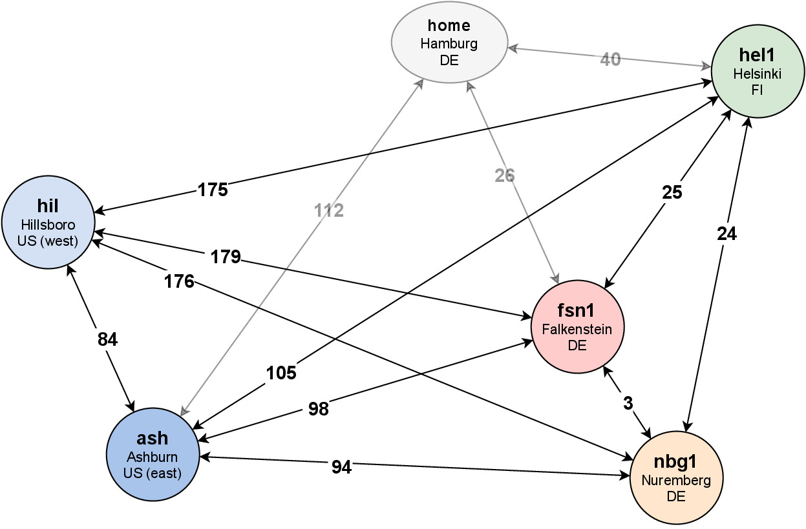

# pingtest

This evaluation performs pairwise pings between all available Hetzner datacenter
locations to get a baseline for the expected network latency during throughput
tests.

* create a server in each location, no need for IPv4
* edit the addresses at the top of `runtest.sh`
* run the test `bash runtest.sh`

The results will be printed to `results.csv`. They've been manually graphed with
https://www.drawio.com/ in `pinggraph.drawio.pdf`.

