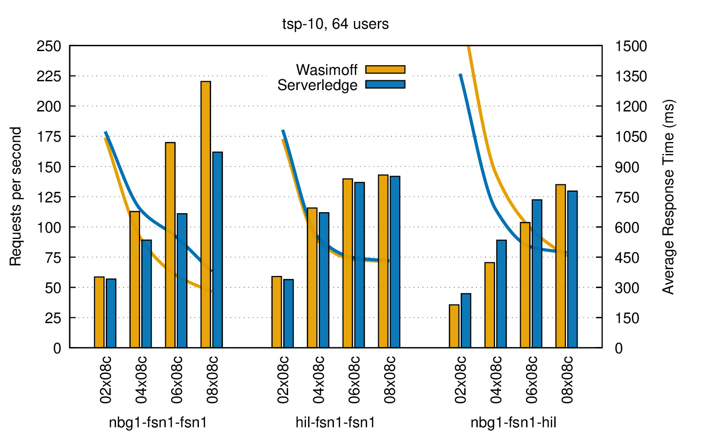
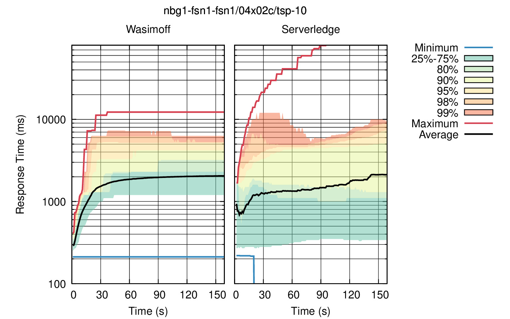
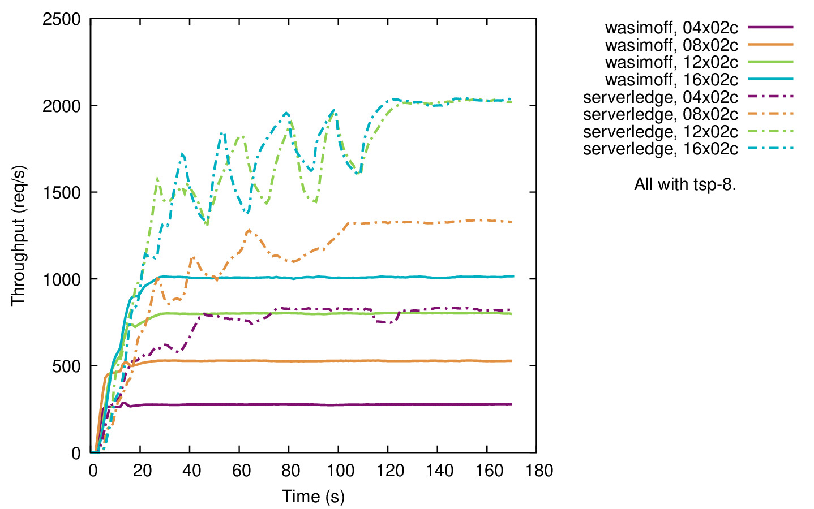

# requests throughput

This is the largest evaluation because it is run on a large number of rented virtual machines. It tests the throughput of offloading requests between Wasimoff and [Serverledge](https://github.com/grussorusso/serverledge/). The setup is tightly integrated with the Ansible configuration, so please check the corresponding README in `../ansible` for details.

* Create a number of servers: 1 Locust node (Client), 1 Broker node and multiple Providers; all need to run Debian 12 and need to be accessible for the Ansible user with root permissions
* Setup the components with the `02-setup-*.yaml` playbooks.
* Connect to the provider nodes to start headless Chromium browsers with Wasimoff using `connect-providers.sh`.
* Connect to the Locust node and run a chosen workload scenario with `connect-locust.sh`.

### Generate the plots

First, after obtaining the raw Locust data in subfolders under `results/...`, you'll need to pull statistics from multiple scenarios into a single histogram CSV file for plotting. This can be done with `pull_historgram_stats.py`. There is a comment with a couple examples at the top of the file.

#### Histograms

The histograms show a comparison of the average throughput between different scenarios / provider configurations / server locations. These can be plotted with `plot_histogram_*.gp` Gnuplot scripts. Each file uses a fixed input file because each interesting comparison requires slightly different plot settings.

#### Percentiles

The percentile plots show the progression of response time percentiles between both frameworks for a single scenario. It allows for conclusions about the "fairness" between individual offloading requests. The plots are created with `plot_percentiles.gp`, while changing variables for `LOCATION`, `CORES` and `TSPN`. The top of the plotscript contains a bash example to plot most interesting percentile plots in a nested loop.

#### Throughput

The throughput shows the progression of the rolling average throughput during a single workload run. Multiple lines can be drawn in a single plot to compare different scenarios. One such combination was chosen to compare Wasimoff and Serverledge with an increasing number of small provider servers. Use `plot_throughput.gp` to create the plot. It needs to be configured manually by changing variables in the script, should you wish to plot a different combination.

