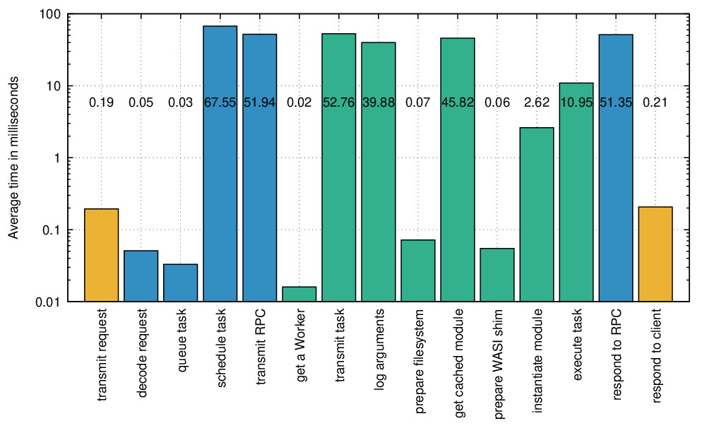

# task lifetime trace

This evaluation was performed to see the contibution of significant steps in the
lifetime of a single task by tracing the system clock at each point and calculating
the deltas. For this reason, this evaluation only works on a local deployment where
the Client, Broker and Provider share a common system clock.

Data is collected with the `broker/tracer/client` command in the Broker code.
Start a local Broker and connect a local Provider to it, then just run the command
with `go run traceclient.go`.

If all went well you should see a simple CSV output.
It needs to be reformatted by passing it through the `sed` command in `transform.sh`.
Finally, edit the `INPUT` variable in `plot_trace.gp` and set it to the name of the
reformatted CSV file; now a simple `gnuplot plot_trace.gp` should generate your
output plot as a PDF.

